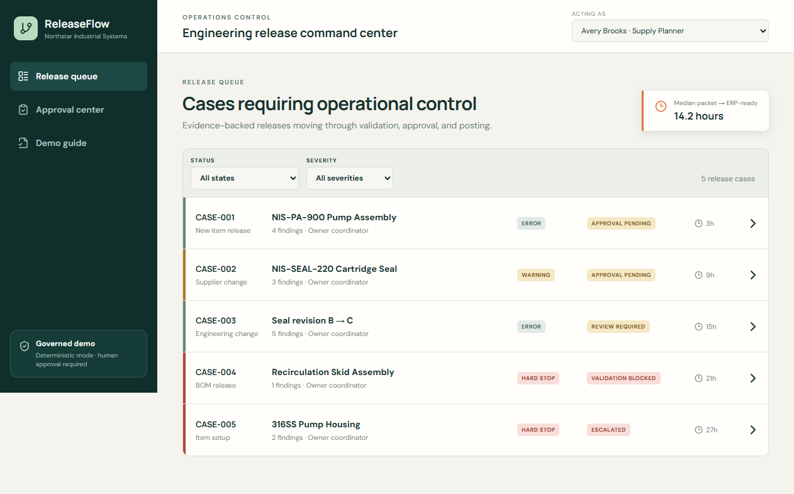
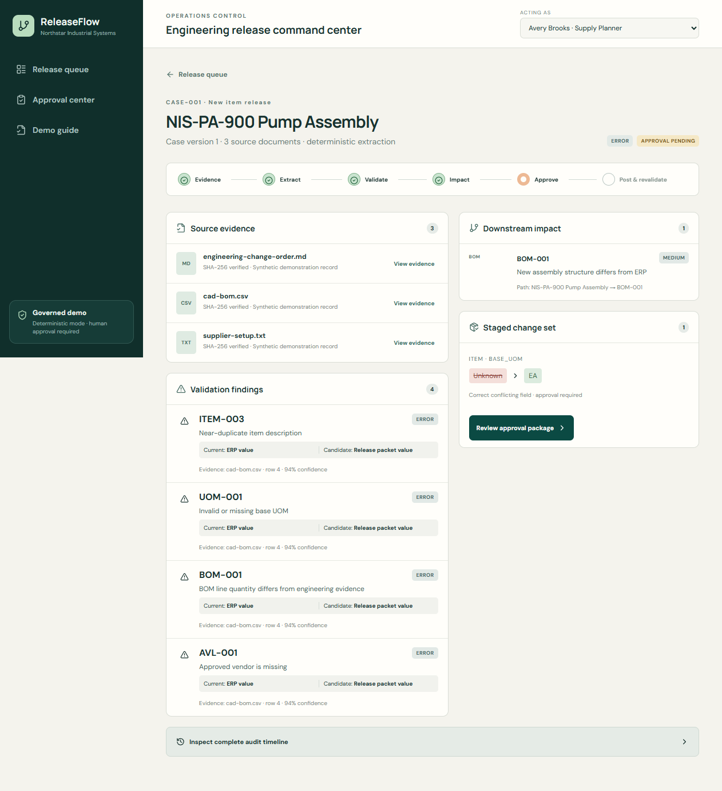
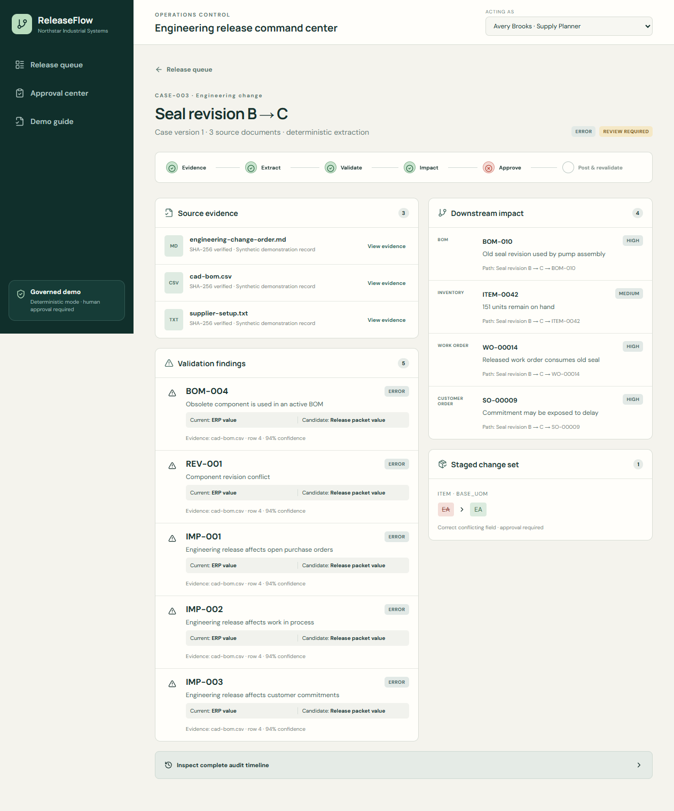
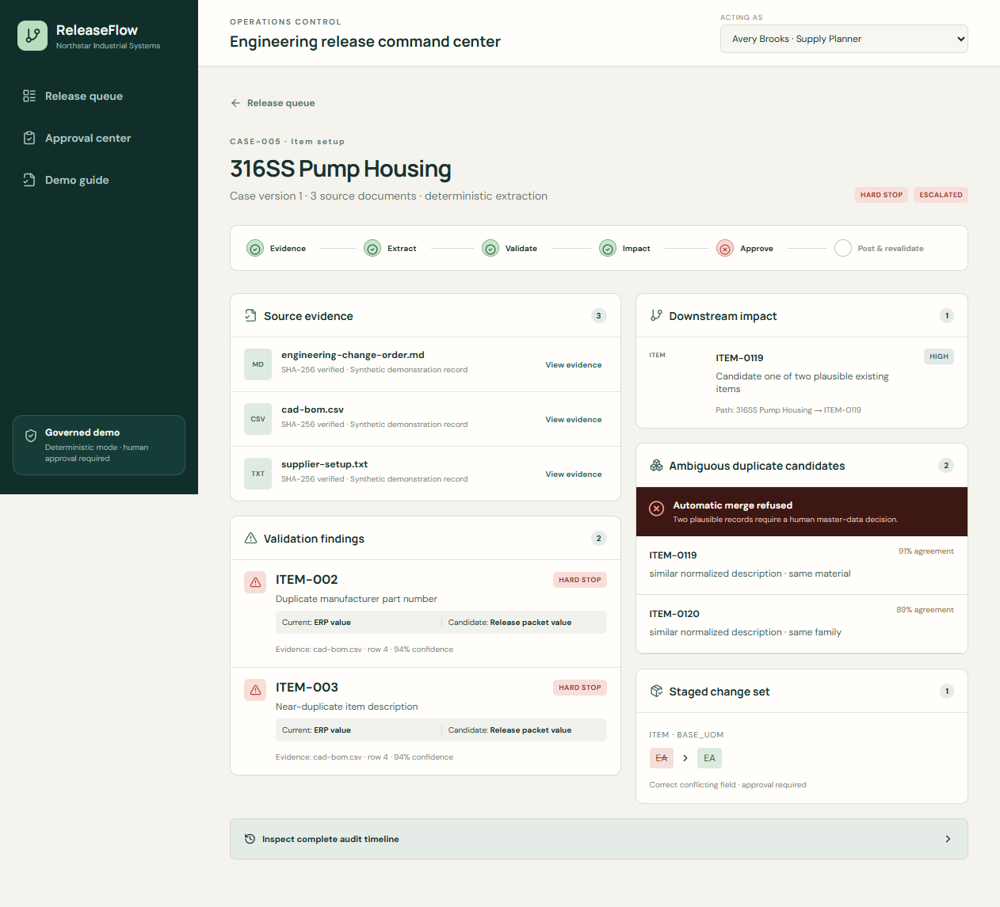
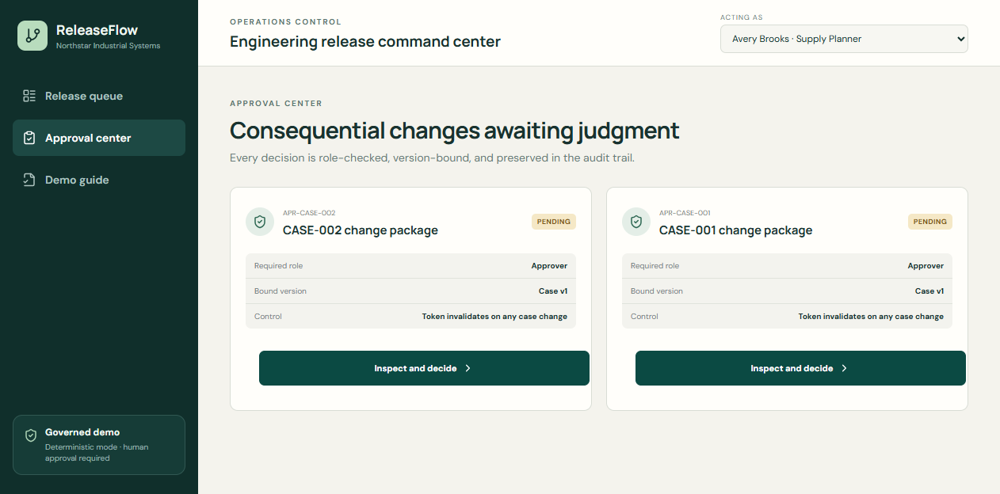
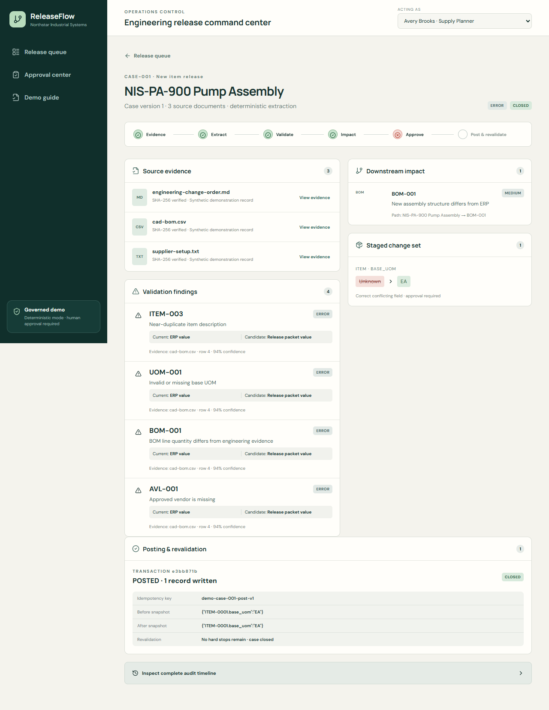
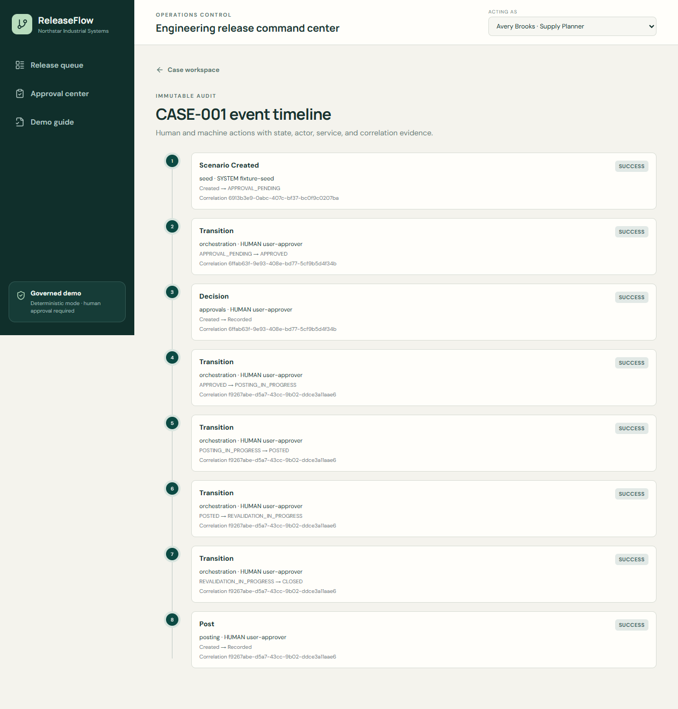
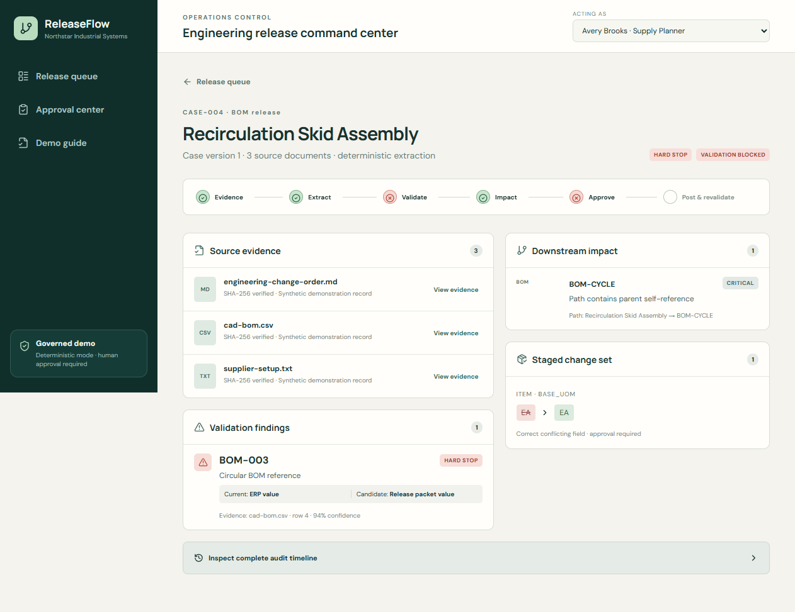

# ReleaseFlow — Governed BOM & Item-Master Release Agent

> ReleaseFlow is a governed AI workflow agent that converts messy engineering and supplier change packets into validated, ERP-ready item and BOM updates, analyzes downstream impact, and posts only human-approved changes with a complete audit trail.

ReleaseFlow is a synthetic portfolio prototype for **Northstar Industrial Systems**, a fictional U.S. fluid-handling equipment manufacturer. It demonstrates the operational handoff between engineering evidence and ERP master data without customer data or proprietary integrations.

## Target user and buyer

The primary users are engineering change coordinators, product master-data analysts, manufacturing systems analysts, and supply-chain systems analysts. The represented buyer is a director of engineering operations, manufacturing systems manager, or operations-excellence leader accountable for release speed, master-data quality, and operational disruption.

## The operational problem

CAD BOM exports, ECOs, specifications, supplier notices, and spreadsheet setup requests rarely agree perfectly with operational systems. Engineers and master-data teams manually reconcile identifiers, revisions, units, packaging, approved vendors, and downstream transactions before release. Bad item or BOM data becomes a supply-chain problem when it disrupts purchasing, WIP, inventory availability, and customer commitments.

ERP and PLM integration transports records; it does not eliminate ambiguous evidence, conflicting business rules, duplicate risk, or the need for accountable decisions. ReleaseFlow owns that residual workflow.

## Why this is an agent

The application observes release packets, invokes bounded typed services, advances an explicit state machine, preserves evidence, pauses at control gates, executes approved changes transactionally, and revalidates the result. It is not a chatbot, generic document summarizer, analytics dashboard, broad MDM suite, or autonomous multi-agent system.

```text
Detect → ingest → extract candidates → validate → find conflicts
→ analyze impact → stage changes → human approval → transactional post
→ revalidate → close or escalate → immutable audit
```

Deterministic rules are authoritative. Optional structured AI is limited to field extraction, description normalization, and fact-grounded explanations. It cannot merge items, approve releases, select substitutions, scrap inventory, cancel POs, or post consequential changes.

## Architecture

- **React/Vite operations client:** release queue, case workspace, approval center, posting status, audit timeline, and guided demo.
- **FastAPI application:** versioned REST contracts, correlation IDs, role enforcement, consistent errors, and OpenAPI.
- **Single bounded orchestrator:** typed validation, deduplication, NetworkX BOM analysis, approval, posting, revalidation, and escalation services.
- **SQLAlchemy/Alembic persistence:** SQLite demo storage with PostgreSQL-ready models, revision history, staged-vs-posted separation, and transactional writes.
- **Deterministic fixtures:** stable synthetic records and evidence work without an API key.

See [architecture](docs/architecture.md), [data model](docs/data-model.md), [governance](docs/governance.md), and [threat model](docs/threat-model.md).

## Demo scenarios

1. **New pump assembly:** duplicate risk, missing UOM, BOM quantity conflict, and missing approved vendor.
2. **Package-size change:** pack 20→24 and MOQ 100→120 expose invalid open PO quantities.
3. **Obsolete seal revision:** where-used paths reach inventory, open POs, released WIP, and customer commitments.
4. **Circular BOM:** structural cycle produces a hard stop and cannot be posted.
5. **Ambiguous duplicate:** two plausible items are shown side-by-side; automatic merge is refused.

## Synthetic data

The deterministic seed contains 300 items, 45 multilevel-capable BOMs, 20 routings, 18 suppliers, 40 vendor relationships, 70 open PO lines, 60 work orders, 35 inventory balances, 25 customer-order lines, 30 ECOs, five polished cases, and the complete 20-rule defect taxonomy. Every source artifact is marked “Synthetic portfolio demonstration data — not a real company record.”

## Local setup

Prerequisites: Python 3.12+, Node 22+, and npm.

```bash
python -m venv .venv
.venv/Scripts/activate              # Windows
python -m pip install -e "backend[dev]"
cd frontend && npm install && cd ..
make seed
```

Run the backend and frontend in separate terminals:

```bash
cd backend && uvicorn app.main:app --reload
cd frontend && npm run dev
```

Open `http://localhost:5173`; API documentation is at `http://localhost:8000/docs`.

### Docker

```bash
docker compose up --build
```

The application is then available at `http://localhost:8080`. The Compose volume preserves the demo database; `POST /api/v1/demo/reset` restores fixtures.

## Optional structured AI

Fixture extraction is the default. Set `EXTRACTION_MODE=openai` and `OPENAI_API_KEY` only to experiment with a future structured-output adapter. Missing credentials, timeouts, or invalid responses must fall back to deterministic extraction and never enter the release workflow unchecked.

## Governance and security boundaries

- Demo user selection uses `X-Demo-User-ID`; the API still enforces roles. This is intentionally not production authentication.
- Approval tokens are random, hashed, single-change-set credentials bound to case version.
- Posting requires an approved current version and an idempotency key, and runs in one transaction.
- Uploads are designed for allowlisted CSV, JSON, TXT, Markdown, PDF, and XLSX files up to 10 MB, with sanitized names and content hashes.
- Document bodies and secrets are excluded from structured logs.
- Staged data cannot become posted data without approval; cycles, ambiguous duplicates, stale approvals, and failed impact queries are hard stops.

## Meaningful KPIs

The primary metric is median time from packet received to approved ERP-ready posting. Supporting measures include manual touches, pre-post findings, escalation rate, accepted candidate fields, duplicate prevention, exposed orders/WIP, first-pass revalidation, approval turnaround, blocked posts, and model fields rejected by deterministic validation.

## Verification

The final local closeout produced these verified results:

- Backend: Ruff lint and format checks passed; MyPy passed for 15 source files; Pytest passed **70 tests**.
- Frontend: ESLint and TypeScript checks passed; Vitest passed **1 test**; the production Vite build passed.
- End to end: Playwright passed **5 workflow tests**.
- Browser verification passed at desktop and mobile widths with five cases, core routes, findings, BOM/where-used impact, duplicate refusal, approval controls, posting/revalidation, circular-BOM blocking, and audit history visible. No Vite error overlay or unexpected failed application requests were observed; the mobile page had no horizontal overflow.
- API health returned `healthy` in deterministic-fixture mode.
- Docker configuration is included but was **not executed locally** because Docker is not installed in the verification environment.
- Local checks used Python **3.11** because that was the available interpreter; project metadata, CI, and containers target Python **3.12+**.

```bash
cd backend
ruff check . && ruff format --check . && mypy app && pytest
cd ../frontend
npm run lint && npm run typecheck && npm test && npm run build
npx playwright test
docker compose config
```

Exact verified results belong in the completion report; this README does not claim unexecuted checks passed.

## Screenshots

The capture narrative is in the [screenshot guide](docs/screenshot-guide.md). All images show fictional Northstar Industrial Systems demonstration data.

| Release queue | Validation workspace |
|---|---|
|  |  |

| BOM and where-used | Duplicate resolution |
|---|---|
|  |  |

| Approval package | Posting and revalidation |
|---|---|
|  |  |

| Audit timeline | Circular BOM hard stop |
|---|---|
|  |  |

## Limitations and non-goals

This prototype does not parse CAD, connect to real ERP/PLM systems, optimize inventory, forecast demand, resolve PO exceptions, score suppliers, manage quality/traceability/claims, or make engineering dispositions. SQLite, fixture authentication, and the mock adapters are demo boundaries, not production recommendations.

## Interview talking points

- Master-data defects become physical operations failures when they affect what gets purchased, built, stocked, or promised.
- Structured candidate fields retain provenance and can be rejected by deterministic rules; free-form chat cannot offer the same control boundary.
- Idempotency prevents retried network calls from duplicating ERP writes.
- Directed BOM graphs reveal cycles and reproducible paths from changed components to affected assemblies and transactions.
- Synthetic data makes the complete workflow safe, portable, and interview-ready.
- Adapter interfaces can later translate approved transactions into SAP, Oracle, Epicor, Odoo, or NetSuite APIs without weakening the approval boundary.
- The agent explicitly refuses automatic merge, substitution, scrap, cancellation, and unapproved posting.

## Future extensions

Production SSO, object storage and malware scanning, PostgreSQL, durable job execution, signed external adapter credentials, SAP/Oracle/Epicor/Odoo/NetSuite connectors, richer file parsers, and calibrated structured-model extraction are deliberate follow-on work—not hidden MVP dependencies.
